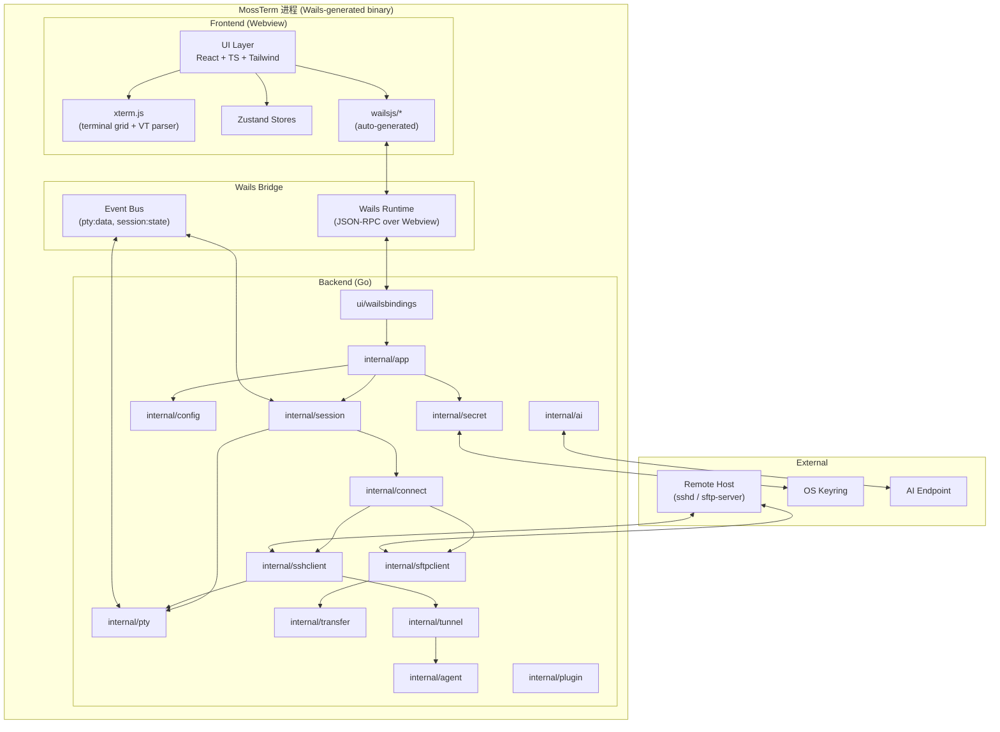
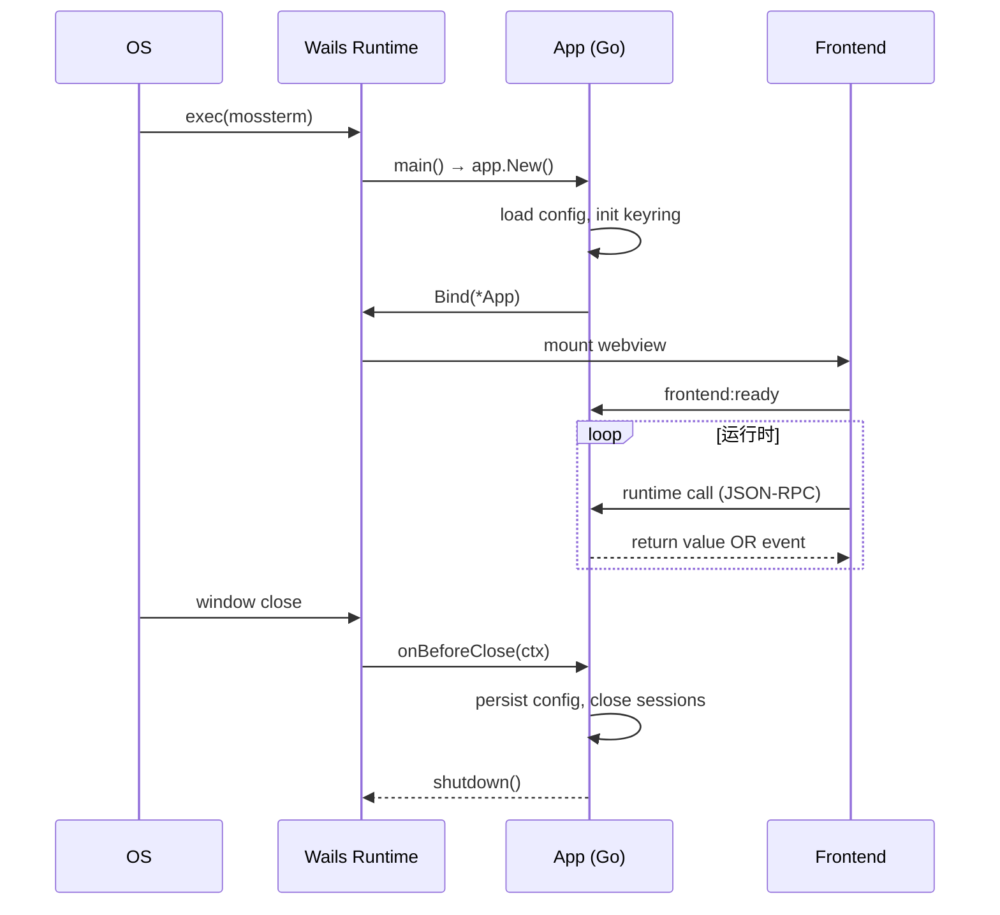
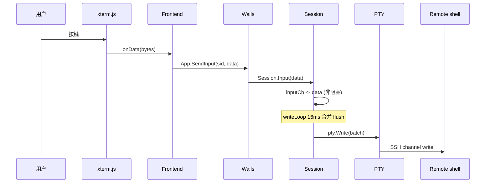
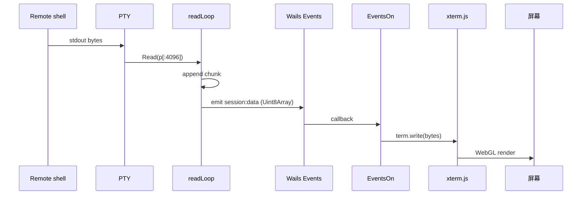
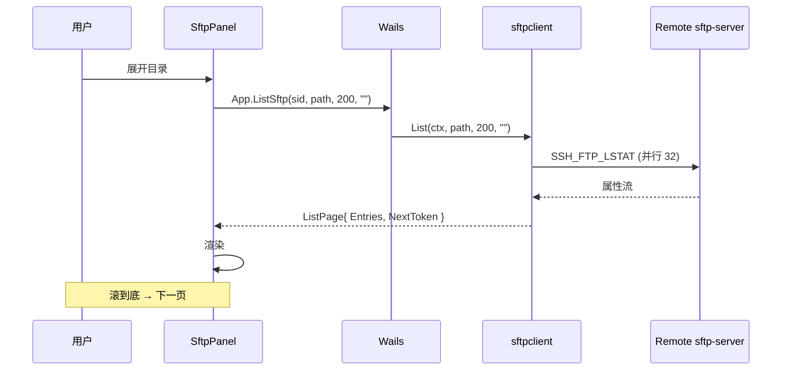
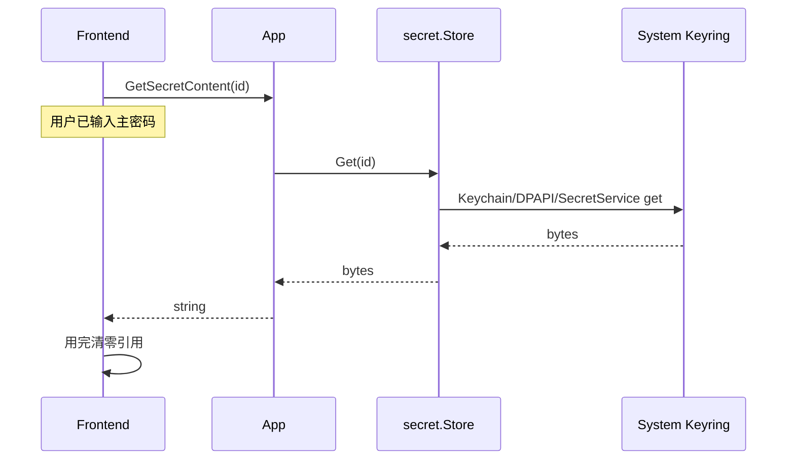

# MossTerm 架构设计文档

> 版本：v0.1（草案） · 状态：架构基线（Architecture Baseline） · 维护者：架构组 / MossTerm Core Team

## 目录

1. [项目愿景与定位](#1-项目愿景与定位)
2. [高层架构图](#2-高层架构图)
3. [模块划分（Go 后端）](#3-模块划分go-后端)
4. [前端架构](#4-前端架构)
5. [关键数据流](#5-关键数据流)
6. [接口契约示例](#6-接口契约示例)
7. [MVP 范围（v0.1）](#7-mvp-范围v01)
8. [风险与对策](#8-风险与对策)
9. [附录](#9-附录)

---

## 1. 项目愿景与定位

### 1.1 一句话定位

> **MossTerm 是一款面向运维工程师、开源透明、性能优先的现代化 SSH 客户端 —— 在浏览器般的体验里使用真正的终端。**

Go 写后端、现代 Web 技术（React + xterm.js）写前端，通过 Wails 粘合成原生
可执行文件。解决的是 WindTerm 等老牌客户端「闭源、庞大、难扩展」的痛点。

### 1.2 与同类产品的差异化

| 维度       | WindTerm        | Tabby          | Electerm      | SecureCRT    | **MossTerm**                    |
| ---------- | --------------- | -------------- | ------------- | ------------ | ------------------------------- |
| 开源       | 闭源            | MIT            | MIT           | 商业闭源     | **MIT**                  |
| 可审计     | 否              | 是             | 是            | 否           | **是 + 依赖全开源**             |
| 渲染后端   | 自绘 Qt         | Electron       | Electron      | 自绘原生     | **xterm.js + WebGL**            |
| 安装包体积 | ~80 MB          | ~150 MB        | ~150 MB       | ~30 MB       | **~20 MB**                      |
| 启动时间   | <1 s            | 2–4 s          | 2–4 s         | <1 s         | **<500 ms**                     |
| 协议       | SSH/Telnet/Ser. | SSH/Telnet/Ser.| SSH           | SSH/Telnet   | SSH/SFTP（v0.1 仅 SSH）         |
| AI 辅助    | 无              | 插件           | 无            | 无           | **内置（命令解释 + 日志总结）** |
| 插件       | 无              | 完善           | 基础          | 无           | **WASM 沙箱（v0.3+）**          |

### 1.3 核心价值观

- **开源（Open by default）**：MIT；禁止引入任何闭源、混淆依赖。
- **可审计（Auditable）**：核心密码学路径（SSH key、keyring、凭据解密）保持
  小范围、注释清晰；CI 跑 `gosec` / `govulncheck` / `npm audit`。
- **性能（Performance as a feature）**：终端渲染不阻塞 UI 线程；PTY 字节
  流必须 batching / ringbuffer；大文件 SFTP 列表分页流式。
- **现代 UX（Modern UX）**：xterm.js + WebGL；命令面板、多 tab、split pane、
  snippet、亮/暗主题。
- **隐私友好（Privacy first）**：默认不上传遥测；AI 默认走本地或可指定
  endpoint。

### 1.4 非目标

- 不做完整 IDE（Git GUI / LSP）。
- 不做 SSH server / 跳板管理平台。
- 不做容器 / K8s 控制台。
- v0.1 不做账户体系与多用户。

---

## 2. 高层架构图

### 2.1 进程内分层



### 2.2 进程生命周期



---

## 3. 模块划分（Go 后端）

### 3.1 目录总览

```text
MossTerm/
├── cmd/mossterm/                 # 主入口
├── internal/
│   ├── app/                      # 应用生命周期 + DI
│   ├── session/                  # 会话/tab/pane
│   ├── connect/                  # 协议抽象 + 注册表
│   ├── sshclient/                # SSH 实现
│   ├── sftpclient/               # SFTP 实现
│   ├── pty/                      # 跨平台 PTY
│   ├── terminal/                 # 终端网格（v0.x 备选）
│   ├── config/                   # TOML 配置
│   ├── secret/                   # 凭据/密钥
│   ├── transfer/                 # 文件传输
│   ├── tunnel/                   # 端口转发
│   ├── agent/                    # 跳板链
│   ├── plugin/                   # WASM 插件宿主
│   ├── ai/                       # AI 辅助
│   ├── ui/wailsbindings/         # 前端暴露方法
│   └── log/                      # 结构化日志
├── pkg/
│   ├── protocol/                 # 协议无关的公共类型
│   └── event/                    # 事件名常量
├── frontend/
└── docs/
```

### 3.2 `cmd/mossterm/` — 主入口

解析 CLI flag（`--debug`、`--config=path`、`--no-gpu`），调用 `wails.Run()`
绑定 `*app.App`，处理 SIGINT/SIGTERM 优雅关闭。`main` 不超过 60 行。

### 3.3 `internal/app/` — 应用生命周期

DI 容器 + Wails 生命周期钩子。**核心类型**：

```go
type App struct {
    ctx       context.Context
    cfg       *config.Manager
    secret    *secret.Store
    sessions  *session.Manager
    transfers *transfer.Engine
    tunnels   *tunnel.Manager
    agents    *agent.Registry
    plugins   *plugin.Host         // v0.3+
    ai        *ai.Client           // v0.2+
    log       *slog.Logger
}

func New(deps Deps) *App
func (a *App) startup(ctx context.Context)        // 私有
func (a *App) onDomReady(ctx context.Context)     // 私有
func (a *App) shutdown(ctx context.Context)       // 私有

// Exposed methods（前端可见）
func (a *App) ListSessions() []session.Info
func (a *App) OpenSession(req session.OpenRequest) (string, error)
func (a *App) CloseSession(id string, force bool) error
func (a *App) SendInput(id string, data []byte) error
func (a *App) ResizePTY(id string, cols, rows int) error
```

所有长耗时操作必须接受 `context.Context`（由 Wails ctx 派生）。

### 3.4 `internal/session/` — 会话管理

一个 `Session` 对应一个终端 tab（v0.2+ 引入 Pane 子树）。维护状态机：
`Connecting → Authenticating → Established → Closing → Closed → Failed`。

**核心类型**：

```go
type ID string

type State int32
const (
    StateConnecting State = iota
    StateAuthenticating
    StateEstablished
    StateClosing
    StateClosed
    StateFailed
)

type Info struct {
    ID        ID     `json:"id"`
    Name      string `json:"name"`
    Host      string `json:"host"`
    Port      int    `json:"port"`
    User      string `json:"user"`
    Protocol  string `json:"protocol"`
    State     State  `json:"state"`
    CreatedAt int64  `json:"createdAt"`
    Cols      int    `json:"cols"`
    Rows      int    `json:"rows"`
}

type OpenRequest struct {
    ProfileID string            `json:"profileId,omitempty"`
    Host      string            `json:"host"`
    Port      int               `json:"port"`
    User      string            `json:"user"`
    Auth      AuthSpec          `json:"auth"`
    Columns   int               `json:"cols"`
    Rows      int               `json:"rows"`
    Env       map[string]string `json:"env,omitempty"`
    JumpVia   []JumpHop         `json:"jumpVia,omitempty"`
}

type AuthSpec struct {
    Kind       string `json:"kind"` // "password"|"publickey"|"agent"|"keyboard-interactive"
    Password   string `json:"password,omitempty"`
    KeyID      string `json:"keyId,omitempty"`
    Passphrase string `json:"passphrase,omitempty"`
}

type JumpHop struct{ ProfileID string `json:"profileId"` }

type Resize struct{ Cols, Rows int }

type Event struct {
    Type    string `json:"type"`           // "data"|"state"|"exit"|"error"
    Data    []byte `json:"data,omitempty"`
    State   State  `json:"state,omitempty"`
    ExitMsg string `json:"exitMsg,omitempty"`
    Err     string `json:"err,omitempty"`
    At      int64  `json:"at"`
}

type Session struct {
    id       ID
    info     atomic.Pointer[Info]
    state    atomic.Int32
    conn     connect.Connector
    pty      pty.PTY
    profile  config.Profile
    inputCh  chan []byte
    resizeCh chan Resize
    closeCh  chan struct{}
    done     chan struct{}
    subMu    sync.RWMutex
    subs     map[int]chan Event
    nextSub  int
}
```

**核心接口**：

```go
type Session interface {
    Start(ctx context.Context) error
    Input(data []byte) error              // 非阻塞，ErrInputFull 时重发
    Resize(cols, rows int) error
    Subscribe() (<-chan Event, func())
    Close(force bool) error
    Info() Info
    State() State
}

type Manager interface {
    Open(ctx context.Context, req OpenRequest) (Session, error)
    Get(id ID) (Session, bool)
    List() []Info
    Close(id ID, force bool) error
    CloseAll(ctx context.Context) error
}

var ErrInputFull = errors.New("session input channel full")
```

**并发模型**：每个 Session 三个 goroutine —— `connectLoop`（握手指令）、
`writeLoop`（合并 inputCh 写入 PTY）、`readLoop`（PTY → Events）。输入批处
理：16 ms 或 4 KB 阈值 flush。

### 3.5 `internal/connect/` — 协议适配

**核心接口**：

```go
type Connector interface {
    Dial(ctx context.Context, params DialParams) (net.Conn, error)
    OpenSession(ctx context.Context, conn net.Conn, opts SessionOpts) (Session, error)
}

type Session interface {  // 协议层
    io.ReadWriteCloser
    Resize(cols, rows int) error
    ShellPID() int
}

type DialParams struct {
    Host      string            `json:"host"`
    Port      int               `json:"port"`
    User      string            `json:"user"`
    Auth      AuthMethod        `json:"auth"`
    Timeout   time.Duration     `json:"timeout"`
    KeepAlive time.Duration     `json:"keepAlive"`
    Extra     map[string]string `json:"extra,omitempty"`
}

type SessionOpts struct {
    Term string            `json:"term"`
    Cols int               `json:"cols"`
    Rows int               `json:"rows"`
    Env  map[string]string `json:"env,omitempty"`
}

type AuthMethod interface { authMethod() }  // sealed
type PasswordAuth string
type PublicKeyAuth struct{ Signer ssh.Signer; Passphrase string }
type AgentAuth struct{}
type KeyboardInteractiveAuth struct{}

type Factory func(deps Deps) Connector

type Registry interface {
    Register(scheme string, f Factory)
    Get(scheme string) (Connector, bool)
}
```

### 3.6 `internal/sshclient/` — SSH 客户端实现

基于 `golang.org/x/crypto/ssh` 实现 `Connector`；维护 host key 持久化
（`~/.config/mossterm/known_hosts`，OpenSSH 格式）。

```go
type Connector struct {
    hostKeyCb   HostKeyCallback
    bannerCb    BannerCallback
    keepAlive   time.Duration
    dialTimeout time.Duration
    signerCache *lru.Cache[string, ssh.Signer]
}

type HostKeyCallback func(host string, remote net.Addr, key ssh.PublicKey) bool
type BannerCallback func(message string)

func New(d Deps) *Connector
func (c *Connector) OpenSession(ctx context.Context, conn net.Conn, opts connect.SessionOpts) (connect.Session, error)
```

默认禁用密码登录；默认 keepalive 30s / 3 次失败重连。

### 3.7 `internal/sftpclient/` — SFTP 客户端实现

在已有 `*ssh.Client` 上开 SFTP subsystem。**核心类型**：

```go
type Client struct{ sc *sftp.Client; sshClient *ssh.Client }
func Open(sshClient *ssh.Client, opts ...Option) (*Client, error)
func (c *Client) List(ctx context.Context, path string, pageSize int, pageToken string) (ListPage, error)
func (c *Client) Stat(p string) (Entry, error)
func (c *Client) ReadDir(p string) ([]Entry, error)
func (c *Client) Open(p string, flags int) (ReadWriteCloser, error)
func (c *Client) Mkdir(p string) error
func (c *Client) Remove(p string) error
func (c *Client) Rename(o, n string) error

type Entry struct {
    Name string; Path string; Size int64
    Mode os.FileMode; ModTime time.Time
    IsDir bool; IsSymlink bool; Link string
}
type ListPage struct{ Entries []Entry; NextToken string }
```

大目录强制分页（`ReadDir` 不行）；上传/下载走 `WriteAt` + 分片 + 断点续传。

### 3.8 `internal/pty/` — PTY 封装

跨平台：macOS / Linux 用 `creack/pty`，Windows 用 ConPTY。**接口**：

```go
type PTY interface {
    io.ReadWriteCloser
    Resize(cols, rows int) error
    PID() int
    TTYName() string
}

type Factory interface {
    Start(ctx context.Context, cmd *exec.Cmd, opts Options) (PTY, error)
}
type Options struct{ Cols, Rows int; Term string; Env []string }
func Default() Factory
```

设计要点：PTY 包只管"打开 pty 设备并暴露 fd"；命令启动由 SSH 协议完成
（`RequestPty + StartShell`）。本地 shell 模式（v0.5+）才用 `cmd`。

### 3.9 `internal/terminal/` — 终端网格（v0.x 备选）

v0.1 不直接使用（前端 xterm.js 替代），但保留 Screen 数据结构供未来
snapshot / 录屏 / 命令回放复用。

```go
type Cell struct{ Rune rune; Attr Attr; Width int }
type Attr struct{ Fg, Bg Color; Bold, Italic, Underline, Reverse, Strike bool }
type Screen struct {
    rows, cols int; grid [][]Cell
    cursorX, cursorY int; savedX, savedY int
    modes Modes; altScreen [][]Cell
}
type Parser struct{ screen *Screen; state parserState; params []int; inter byte }
func (p *Parser) Feed(data []byte) (events []Event)
```

### 3.10 `internal/config/` — 配置

TOML 格式，存 `~/.config/mossterm/config.toml`。fsnotify 监听外部编辑。
**核心类型**：

```go
type Manager struct{ path string; mu sync.RWMutex; data Data }
type Data struct {
    Version  int                       `toml:"version"`
    Settings Settings                  `toml:"settings"`
    Profiles map[string]Profile        `toml:"profiles"`
    Layouts  map[string]Layout         `toml:"layouts"`
    Keymaps  map[string]Keymap         `toml:"keymaps"`
    Themes   map[string]Theme          `toml:"themes"`
    Recent   []string                  `toml:"recent"`
}
type Settings struct {
    DefaultTheme, DefaultFont string
    FontSize, Scrollback, KeepAliveSecs int
    AllowPassword, Telemetry, CheckUpdate bool
    AIProvider, AIEndpoint, AIKeyID string
}
type Profile struct {
    ID, Name, Group, Host string
    Port int
    User, Color, Icon string
    Auth       AuthConfig
    Env        map[string]string
    JumpVia    []string
    Tags       []string
    CreatedAt, UpdatedAt int64
}
type AuthConfig struct {
    Kind, KeyID, Username, Command string
}
type Layout struct{ ID, Name string; Tabs []Tab }
type Tab struct{ Title string; Panes []Pane }
type Pane struct{ ProfileID, Split string; Size int }
type Keymap struct{ Bindings map[string]string `toml:"bindings"` }
type Theme struct{ Name, Bg, Fg, Cursor string; Ansi []string `toml:"ansi"` }

func Load(path string) (*Manager, error)
func (m *Manager) Save() error
func (m *Manager) Get() Data
func (m *Manager) Update(mutate func(*Data)) error
func (m *Manager) Watch() (<-chan Data, func())
```

Schema 变更必须写 `migrations/00X_xxx.go`。

### 3.11 `internal/secret/` — 凭据/密钥管理

多级后端：系统 keyring（macOS Keychain / Windows Credential Manager /
Linux Secret Service）→ 加密文件 fallback（AES-256-GCM，Argon2id 派生
key）→ 内存（仅当前 session）。**接口**：

```go
type Kind string
const (
    KindPassword Kind = "password"
    KindPrivateKey Kind = "private_key"
    KindAPIKey Kind = "api_key"
    KindPassphrase Kind = "passphrase"
)
type ID string
type Item struct {
    ID ID; Name string; Kind Kind
    Fingerprint string; CreatedAt, LastUsed int64
}
type Store interface {
    Set(name string, kind Kind, secret []byte, meta map[string]string) (ID, error)
    Get(id ID) ([]byte, error)         // 调用方负责 zeroize
    Delete(id ID) error
    List() ([]Item, error)
    HasPassphrase() bool
    SetPassphrase(pass string) error
    Close() error
}
func New(cfg Config) (Store, error)
type Config struct {
    UseSystemKeyring bool
    FallbackPath     string
    Argon2Params     argon2.Params
}
```

**安全约束**：不打印 `Get` 结果；不在任何日志里序列化；调用方用完
`subtle.ConstantTimeCompare`；退出时 `Close()` 清零缓存。

### 3.12 `internal/transfer/` — 文件传输

多连接并发（默认 4 分片）+ 断点续传（SHA-256 校验）+ 进度 Wails 事件。

```go
type Direction int
const (Upload Direction = iota; Download)
type JobID string
type Job struct {
    ID JobID; Direction Direction
    LocalPath, RemotePath string
    Size, Transferred, Speed int64
    State JobState; Error string; StartedAt int64
}
type JobState int
const (
    StateQueued JobState = iota
    StateRunning; StatePaused
    StateCompleted; StateFailed; StateCanceled
)
type Engine interface {
    Enqueue(job Job, opts Options) (JobID, error)
    List() []Job
    Get(id JobID) (Job, bool)
    Pause(id JobID) error; Resume(id JobID) error; Cancel(id JobID) error
    Subscribe() (<-chan Progress, func())
}
type Options struct {
    Chunks int; ChunkSize int64
    Overwrite OverwriteMode
    PreserveMode bool
}
type Progress struct{ JobID JobID; Transferred, Speed int64; Eta time.Duration }
```

队列上限：默认同时 3 任务 × 4 chunk = 12 并发 SFTP 请求。

### 3.13 `internal/tunnel/` — 端口转发

支持本地（`-L`）/ 远程（`-R`）/ 动态（`-D` SOCKS5）三种模式。

```go
type Mode int
const (Local Mode = iota; Remote; Dynamic)
type Spec struct {
    ID string; Mode Mode
    BindHost string; BindPort int
    TargetHost string; TargetPort int
    SessionID string
}
type Tunnel interface {
    Start(ctx context.Context) error
    Stop() error
    Spec() Spec
    State() TunnelState
    Stats() Stats
}
type Stats struct{ BytesIn, BytesOut int64; ActiveConns int; StartedAt int64 }
type Manager interface {
    Open(ctx context.Context, spec Spec) (Tunnel, error)
    Close(id string) error
    List() []Spec
    Get(id string) (Tunnel, bool)
}
```

### 3.14 `internal/agent/` — 跳板链 + 代理

```go
type Client interface {
    Signers() ([]ssh.Signer, error)
    Close() error
}
func NewAgentClient(socketPath string) (Client, error)

type Registry interface {
    BuildChain(ctx context.Context, hops []Hop, finalTarget Target) (*ssh.Client, error)
}
type Hop struct{ ProfileID string }
type Target struct{ Host string; Port int; User string; Auth connect.AuthMethod }

type ProxyCommand struct{ Cmd string; Args []string }
```

### 3.15 `internal/plugin/` — 插件系统骨架（v0.3+）

WASM 沙箱（`tetratelabs/wazero`）。**接口**：

```go
type Host interface {
    Load(name string, wasm []byte) (Plugin, error)
    Get(name string) (Plugin, bool)
    List() []Manifest
    Unload(name string) error
}
type Plugin interface {
    Name() string
    Manifest() Manifest
    Call(ctx context.Context, fn string, args ...interface{}) (interface{}, error)
    Subscribe(topic string) (<-chan Event, func())
}
type Manifest struct {
    Name, Version, Author, Entry, Description string
    Permissions []string
}
type Event struct{ Topic string; Payload []byte }
```

v0.1 状态：仅留接口 + stub（拒绝加载任何 .wasm），骨架存在但功能未启用。

### 3.16 `internal/ai/` — AI 辅助（v0.2+）

```go
type Provider string
const (OpenAI Provider = "openai"; Ollama Provider = "ollama"; Anthropic Provider = "anthropic")
type Client interface {
    Explain(ctx context.Context, cmd string) (string, error)
    Summarize(ctx context.Context, log, hint string) (string, error)
    Suggest(ctx context.Context, history []string) ([]string, error)
}
type Options struct {
    Provider Provider; Endpoint, KeyID, Model string
    Timeout time.Duration; MaxTokens int
}
func New(opts Options) (Client, error)
```

**隐私**：默认不开启；UI 弹"确认发送"对话框；支持 `Ollama` 完全离线。

### 3.17 `internal/ui/wailsbindings/` — Wails 绑定

这一层是"哪些方法暴露给前端"的白名单。组合 `*app.App` 并转发方法，避免
内部重构破坏前端契约。

```go
type App struct{ core *app.App }
func New(core *app.App) *App

// Profile CRUD
func (a *App) ListProfiles() []config.Profile
func (a *App) SaveProfile(p config.Profile) error
func (a *App) DeleteProfile(id string) error

// Secret（仅元数据，秘密内容需用户主密码）
func (a *App) ListSecretsItems() []secret.Item
func (a *App) SaveSecret(name, kind, content string) (string, error)
func (a *App) GetSecretContent(id string) (string, error)
```

### 3.18 `pkg/` — 公共 API

`pkg/` 保持严格 semver。**`pkg/protocol/`**：

```go
const Version = "0.1.0"
const MagicByte byte = 0x4D  // 'M'
type Scheme string
const (
    SchemeSSH Scheme = "ssh"; SchemeSFTP Scheme = "sftp"
    SchemeTelnet Scheme = "telnet"; SchemeSerial Scheme = "serial"
)
```

**`pkg/event/`** 暴露 Wails 事件总线字符串常量：

```go
const (
    SessionData = "session:data"        // { id, data: Uint8Array }
    SessionState = "session:state"      // { id, state }
    SessionExit = "session:exit"        // { id, code, msg }
    TransferProgress = "transfer:progress"
    TransferDone = "transfer:done"
    AIResponse = "ai:response"
    LogLine = "log:line"
)
```

---

## 4. 前端架构

### 4.1 技术选型

| 领域   | 选型                          | 理由                          |
| ------ | ----------------------------- | ----------------------------- |
| 框架   | **React 18**                  | 生态成熟、TypeScript 友好     |
| 语言   | **TypeScript 5.x**            | 强类型、与 Go 契约清晰        |
| 构建   | **Vite 5**                    | 快、Wails 模板默认支持        |
| 样式   | **Tailwind CSS 3**            | 原子化、易做主题              |
| 状态   | **Zustand 4**                 | 轻量、无 boilerplate          |
| 终端   | **xterm.js 5 + addons**       | 工业级、VT 解析成熟、WebGL    |
| 测试   | **Vitest + Testing Library**  | 与 Vite 同源                  |
| 包管理 | **pnpm**                      | 磁盘省、快                    |

### 4.2 目录结构

```text
frontend/
├── index.html
├── package.json
├── tsconfig.json
├── vite.config.ts
├── tailwind.config.ts
└── src/
    ├── main.tsx
    ├── App.tsx
    ├── components/
    │   ├── Terminal/
    │   │   ├── Terminal.tsx
    │   │   ├── useTerminal.ts
    │   │   └── themes.ts
    │   ├── TabBar/                    # v0.2+
    │   ├── SessionTree/
    │   │   ├── SessionTree.tsx
    │   │   ├── ProfileNode.tsx
    │   │   └── useSessionTree.ts
    │   ├── SftpPanel/                 # v0.2+
    │   ├── CommandPalette/
    │   │   ├── CommandPalette.tsx
    │   │   └── commands.ts
    │   ├── StatusBar/
    │   ├── Settings/
    │   └── common/                    # Button/Modal/Toast/Icon
    ├── stores/
    │   ├── sessionStore.ts
    │   ├── profileStore.ts
    │   ├── settingsStore.ts
    │   ├── uiStore.ts
    │   ├── transferStore.ts
    │   └── aiStore.ts
    ├── wailsjs/                       # Wails 自动生成（不手改）
    │   ├── go/app/App.{d.ts,js}
    │   └── runtime/runtime.{d.ts,js}
    ├── lib/
    │   ├── ipc.ts                     # 包装 Wails 调用
    │   ├── events.ts                  # 事件名常量（与 pkg/event 镜像）
    │   ├── keymap.ts
    │   └── format.ts
    ├── types/                         # session/profile/transfer/event
    ├── styles/                        # globals.css / themes.css
    └── assets/icons/
```

### 4.3 状态管理约定

- **server state**（profiles、secrets 元数据）：Zustand + `subscribeWithSelector`
  缓存 Wails 调用结果。
- **UI state**（命令面板、侧栏）：Zustand。
- **PTY 字节（热路径）**：**不走** Zustand。xterm.js 内部 buffer + 直接
  `EventsOn('session:data', ...)` 回调 `term.write(Uint8Array)`。

### 4.4 关键组件

**`Terminal.tsx`**
- 接收 `sessionId: string`。
- 挂载时创建 `Terminal` 实例 + `FitAddon` + `WebglAddon`。
- `term.onData` → `App.SendInput(sessionId, data)`。
- `term.onResize` → `App.ResizePTY(sessionId, cols, rows)`。
- 监听 `session:data` → `term.write(Uint8Array)`。
- 监听 `session:state` → 更新外层徽标。
- 销毁：`term.dispose()` + `EventsOff`。

**`SessionTree.tsx`**：左侧抽屉。数据源 `profileStore` + 活跃 session。
拖拽排序 v0.2 引入 `dnd-kit`。

**`CommandPalette.tsx`**：`Ctrl+Shift+P` 唤起，fuse.js 模糊匹配。命令
来源：内置（开关侧栏、清屏、关闭 tab 等）+ profile 列表 + 插件贡献
（v0.3+）。

---

## 5. 关键数据流

### 5.1 终端输入（键盘 → 远端）



### 5.2 终端输出（远端 → 屏幕）



**优化**：
- 单次 `Read` 不直接 emit；4 KB / 16 ms 聚合。
- Wails emit `[]byte` → 前端 `Uint8Array`，跳过 base64。
- xterm.js ring buffer 喂 WebGL renderer，不阻塞 JS 主线程。
- 订阅者消费慢时，后端 buffer 满则丢最早数据并 emit `session:overflow`。

### 5.3 SFTP 列表（v0.2+）



### 5.4 凭据读取



**约束**：返回值不得存入 Zustand（避免 DevTools 泄露）；调用栈要短。

---

## 6. 接口契约示例

> 本节是给后续 coder 的"硬契约"。任何变更必须先改本节并提 PR。

### 6.1 `connect.Connector`（Go）

```go
// internal/connect/connector.go
package connect

import (
    "context"
    "io"
    "net"
    "time"

    "golang.org/x/crypto/ssh"
)

// Connector 是任意协议适配器必须实现的契约。
//
// 生命周期：
//   1. session.Manager 调用 Dial 建立到目标主机的协议层连接。
//   2. 在 conn 之上调用 OpenSession 获取一个交互通道。
//   3. pty 包以这个通道作为 slave 端，叠加 PTY 语义。
//   4. 使用方调用 Close 释放资源。
type Connector interface {
    // Dial 建立到目标主机的协议层连接。
    // host 可以是域名 / IPv4 / IPv6 literal。port=0 用协议默认端口。
    // 返回的 net.Conn 语义上是"已协商好协议的连接"，可被 sftp / tunnel 直接使用。
    // ctx.Done() 返回时必须立刻返回 ctx.Err()。
    Dial(ctx context.Context, params DialParams) (net.Conn, error)

    // OpenSession 在已 Dial 的连接上开启一个交互会话。
    // 返回的 Session 必须实现 io.ReadWriteCloser + Resize。
    // 远端进程退出时 Read 返回 io.EOF。
    OpenSession(ctx context.Context, conn net.Conn, opts SessionOpts) (Session, error)
}

// Session 是协议层会话（区别于 MossTerm 业务层 Session）。
type Session interface {
    io.ReadWriteCloser
    Resize(cols, rows int) error
    ShellPID() int
}

type DialParams struct {
    Host      string            `json:"host"`
    Port      int               `json:"port"`
    User      string            `json:"user"`
    Auth      AuthMethod        `json:"auth"`
    Timeout   time.Duration     `json:"timeout"`
    KeepAlive time.Duration     `json:"keepAlive"`
    Extra     map[string]string `json:"extra,omitempty"`
}

type SessionOpts struct {
    Term string            `json:"term"`
    Cols int               `json:"cols"`
    Rows int               `json:"rows"`
    Env  map[string]string `json:"env,omitempty"`
}

// AuthMethod 是 sum-type（sealed）。
type AuthMethod interface{ authMethod() }

type PasswordAuth string
type PublicKeyAuth struct {
    Signer     ssh.Signer
    Passphrase string
}
type AgentAuth struct{}
type KeyboardInteractiveAuth struct{}

func (PasswordAuth) authMethod()             {}
func (PublicKeyAuth) authMethod()            {}
func (AgentAuth) authMethod()                {}
func (KeyboardInteractiveAuth) authMethod()  {}

var _ interface {
    io.ReadWriteCloser
    Resize(cols, rows int) error
    ShellPID() int
} = (Session)(nil)
```

### 6.2 `session.Session` / `session.Manager`（Go）

```go
// internal/session/session.go
package session

import (
    "context"
    "errors"
    "sync/atomic"
)

// ID 是会话唯一标识，UUID v4 字符串形式。
type ID string

// Info 是序列化给前端的会话元数据，不含任何秘密。
type Info struct {
    ID        ID     `json:"id"`
    Name      string `json:"name"`
    Host      string `json:"host"`
    Port      int    `json:"port"`
    User      string `json:"user"`
    Protocol  string `json:"protocol"`
    State     State  `json:"state"`
    CreatedAt int64  `json:"createdAt"`
    Cols      int    `json:"cols"`
    Rows      int    `json:"rows"`
}

type State int32

const (
    StateConnecting State = iota
    StateAuthenticating
    StateEstablished
    StateClosing
    StateClosed
    StateFailed
)

func (s State) String() string { /* ... */ }

type OpenRequest struct {
    ProfileID string            `json:"profileId,omitempty"`
    Host      string            `json:"host"`
    Port      int               `json:"port"`
    User      string            `json:"user"`
    Auth      AuthSpec          `json:"auth"`
    Columns   int               `json:"cols"`
    Rows      int               `json:"rows"`
    Env       map[string]string `json:"env,omitempty"`
    JumpVia   []JumpHop         `json:"jumpVia,omitempty"`
}

type AuthSpec struct {
    Kind       string `json:"kind"`
    Password   string `json:"password,omitempty"`
    KeyID      string `json:"keyId,omitempty"`
    Passphrase string `json:"passphrase,omitempty"`
}

type JumpHop struct{ ProfileID string `json:"profileId"` }

type Resize struct{ Cols, Rows int }

type Event struct {
    Type    string `json:"type"`
    Data    []byte `json:"data,omitempty"`
    State   State  `json:"state,omitempty"`
    ExitMsg string `json:"exitMsg,omitempty"`
    Err     string `json:"err,omitempty"`
    At      int64  `json:"at"`
}

type Session interface {
    Start(ctx context.Context) error
    Input(data []byte) error                          // 非阻塞，ErrInputFull 时重发
    Resize(cols, rows int) error
    Subscribe() (<-chan Event, func())
    Close(force bool) error
    Info() Info
    State() State
}

type Manager interface {
    Open(ctx context.Context, req OpenRequest) (Session, error)
    Get(id ID) (Session, bool)
    List() []Info
    Close(id ID, force bool) error
    CloseAll(ctx context.Context) error
}

var ErrInputFull = errors.New("session input channel full")
```

### 6.3 前端 TypeScript 类型（与 Go DTO 镜像）

```typescript
// src/types/session.ts
export type SessionID = string;

export type SessionState =
  | "connecting" | "authenticating" | "established"
  | "closing" | "closed" | "failed";

export interface SessionInfo {
  id: SessionID;
  name: string;
  host: string;
  port: number;
  user: string;
  protocol: "ssh" | "sftp" | "telnet" | "serial";
  state: SessionState;
  createdAt: number;
  cols: number;
  rows: number;
}

export type AuthKind =
  | "password" | "publickey" | "agent" | "keyboard-interactive";

export interface AuthSpec {
  kind: AuthKind;
  password?: string;
  keyId?: string;
  passphrase?: string;
}

export interface OpenRequest {
  profileId?: string;
  host: string;
  port: number;
  user: string;
  auth: AuthSpec;
  cols: number;
  rows: number;
  env?: Record<string, string>;
  jumpVia?: { profileId: string }[];
}

// src/types/event.ts
export interface SessionDataEvent { id: SessionID; data: Uint8Array; }
export interface SessionStateEvent { id: SessionID; state: SessionState; }
export interface SessionExitEvent { id: SessionID; code: number; msg: string; }
export interface TransferProgressEvent {
  jobId: string; transferred: number; speed: number; eta: number;
}

export type AppEvent =
  | { topic: "session:data"; payload: SessionDataEvent }
  | { topic: "session:state"; payload: SessionStateEvent }
  | { topic: "session:exit"; payload: SessionExitEvent }
  | { topic: "transfer:progress"; payload: TransferProgressEvent }
  | { topic: "transfer:done"; payload: { jobId: string; error?: string } }
  | { topic: "ai:response"; payload: { requestId: string; text: string; error?: string } };
```

### 6.4 前端调用后端的标准封装

```typescript
// src/lib/ipc.ts
import * as App from "@wailsapp/wailsjs/go/app/App";
import { EventsOn, EventsOff } from "@wailsapp/wailsjs/runtime/runtime";

export async function listSessions(): Promise<SessionInfo[]> {
  return App.ListSessions();
}
export async function openSession(req: OpenRequest): Promise<SessionID> {
  return App.OpenSession(req);
}
export async function closeSession(id: SessionID, force = false): Promise<void> {
  return App.CloseSession(id, force);
}
export async function sendInput(id: SessionID, data: Uint8Array): Promise<void> {
  return App.SendInput(id, data);
}
export async function resizePTY(id: SessionID, cols: number, rows: number): Promise<void> {
  return App.ResizePTY(id, cols, rows);
}

export function onSessionData(handler: (ev: SessionDataEvent) => void): () => void {
  EventsOn("session:data", handler);
  return () => EventsOff("session:data");
}
```

---

## 7. MVP 范围（v0.1）

### 7.1 必须包含

- **单 session**（v0.1 暂不做 tab 切换；只允许一个交互终端）。
- **SSH 协议**：密码 + 公私钥（OpenSSH 格式）+ ssh-agent；主机指纹首次信
  任后写入 `known_hosts`，第二次自动验证；keepalive 30s。
- **基础终端渲染**：xterm.js + WebGL addon + Fit addon；256 色 / true
  color / 常用转义；字体默认 JetBrains Mono 可调；主题：亮 / 暗 / 跟随
  系统。
- **复制粘贴**：`Ctrl+Shift+C` / `Ctrl+Shift+V`；`Ctrl+Insert` / 
  `Shift+Insert` 兼容；鼠标选中自动复制（可关闭）。
- **窗口控制**：关闭触发 `App.CloseSession(force=false)`，等 EOF 后再
  关闭；`Established` 状态弹"关闭确认"。
- **Profile 增删改查**：字段 name / host / port / user / auth kind /
  keyId。
- **配置持久化**：`~/.config/mossterm/config.toml`。
- **日志面板**：`View → Toggle Log Panel`（默认隐藏）。

### 7.2 不包含

| 功能               | 原因                       | 计划版本 |
| ------------------ | -------------------------- | -------- |
| 多 tab             | 状态管理复杂度             | v0.2     |
| SFTP 面板          | 独立面板 + 拖拽 + 进度     | v0.2     |
| 跳板链             | 抽象 + 测试基础设施        | v0.2     |
| 端口转发（-L/-R/-D）| UI 复杂度 + 测试矩阵       | v0.2     |
| Telnet / Serial    | 协议适配工作量             | v0.3     |
| 插件系统           | 需稳定内部 API             | v0.3     |
| AI 辅助            | 需 settings + 隐私对话框   | v0.2     |
| 多端同步           | 需账户体系或自托管         | v0.4     |
| 录屏 / 回放        | 完整 buffer + 编码         | v0.4     |
| 多窗口             | Wails 多窗口支持有限       | v0.5     |
| 自动更新           | 签名 + 升级服务器          | v0.4     |
| 国际化（i18n）     | 推迟到至少简中 + 英文后    | v0.3     |

### 7.3 验收标准

- [ ] 从源码 `wails build` 成功，产物可启动。
- [ ] `wails dev` 在 macOS / Windows / Ubuntu 三平台热重载跑通。
- [ ] CI 跑通：`go test ./...` 覆盖率 ≥ 60%，`npm test` 全绿，`gosec` 0 高危。
- [ ] 密码登录 Linux VM 并执行 `ls -la`、`cat /etc/os-release`。
- [ ] 公私钥登录并验证服务器指纹。
- [ ] 关闭应用时无 goroutine 泄漏（`pprof` 验证）。
- [ ] 内存占用空载 < 80 MB。

---

## 8. 风险与对策

### 8.1 终端性能瓶颈

**风险**：大输出（`cat large.log`）瞬间产生数十 MB 数据，IPC + JS 拷贝 +
xterm 解析都可能成为瓶颈。Wails 事件总线对二进制不友好。

**对策**：
1. **二进制事件**：`EventsEmit([]byte)` → 前端 `Uint8Array`，跳过 base64。
2. **batching**：后端按 4 KB / 16 ms 聚合 emit。
3. **丢帧策略**：前端累积未渲染字节 > 1 MB 时，丢弃最早 256 KB，避免主线程
   阻塞。
4. **WebGL renderer**：xterm.js WebGL addon 60 fps 渲染 10k 行/秒。
5. **背压**：订阅者慢时 buffer 满则丢最早数据并 emit `session:overflow`。
6. **profiling 工具**：`View → Profiler` 开关，DevTools 抓 heap / cpu。

### 8.2 跨平台 PTY 差异

**风险**：macOS / Linux 用 BSD / Linux PTY（creack/pty），Windows ConPTY
是完全不同的 API；颜色查询在 Windows 上行为不同。

**对策**：
1. `internal/pty.Factory` 接口 + 平台实现（build tag `*_unix.go` /
   `*_windows.go`）。
2. CI 在 macOS / Ubuntu / Windows 跑端到端测试，验证 `tmux` / `htop` /
   `vim` 表现一致。
3. Windows 早期版本不支持 ConPTY 时回退 winpty。
4. xterm.js 一致性：让前端无需判断平台。

### 8.3 凭据安全存储

**风险**：Linux Secret Service 依赖 GNOME/KDE，headless 可能没有；加密
文件 fallback 需主密码，忘记则数据不可恢复；内存明文密码 GC 不可控。

**对策**：
1. **多级 fallback**：系统 keyring → 加密文件 → 内存（仅当前 session）。
2. **主密码**：Argon2id 派生 key，参数 `time=2, memory=64MB, threads=4`
   （OWASP 2024）。
3. **零内存策略**：`Get` 返回的 bytes 调用方清零；缓存 30s 到期清零。
4. **审计**：`internal/secret` < 500 行，超限 CI 报警。
5. **红队测试**：每 milestone 用 `gosec` + fuzz 验证"不打印、不序列化、
   不写日志"。

### 8.4 xterm.js 与 Wails 高频事件

**风险**：极端场景每秒上百个事件，每个几 KB；Wails 事件总线同步，emit
阻塞会拖慢 `readLoop`；浏览器 `EventsOn` 回调串行执行。

**对策**：
1. 后端聚合（4 KB / 16 ms 阈值）。
2. 前端 `requestAnimationFrame` 合并同帧多次 `term.write`。
3. v0.5 探索 OffscreenCanvas / Worker 移出主线程。
4. CI 跑合成事件流量（5k 事件/秒）验证不丢数据。
5. `Settings → Performance → Reduce motion` 关动画省 5-10% CPU。

### 8.5 SSH 主机密钥中间人

**风险**：首次连接"信任指纹"对话框 UX 不好时，用户无脑 yes。

**对策**：
1. 弹窗显示 SHA256 指纹（与 `ssh-keygen -lf` 一致）+ 主机名/IP/端口。
2. `known_hosts` 采用 OpenSSH 格式，方便导入/导出。
3. 三级严格度：`accept-new`（默认）/ `yes`（推荐生产）/ `no`（仅调试）。
4. profile 编辑器显示"上次连接指纹"，异常时高亮警告。

### 8.6 Wails 升级与 API 兼容

**风险**：Wails 2.x → 3.x 可能 breaking change；`wailsjs/` 自动生成在团
队协作时易冲突。

**对策**：
1. `wails.json` 固定 minor 版本，升级走单独 PR。
2. 升级跑完整 E2E 套件。
3. `wailsjs/` 提交入仓（虽然默认 `.gitignore`）；`make generate` 重新生成。

### 8.7 跨平台安装包

**风险**：macOS 需签名 + notarization；Windows 需 EV 证书 SmartScreen 
友好；Linux 包格式多。

**对策**：
1. v0.1 内部分发：仅 tar.gz / zip，免签名。
2. v0.2 公测：GitHub Releases；macOS 用 `gon` + Apple Developer；Windows
   用 SignPath.io 免费开源证书；Linux 产 deb / rpm / AppImage。
3. v0.4 Homebrew tap / scoop bucket。

---

## 9. 附录

### 9.1 术语表

| 术语         | 定义                                                |
| ------------ | --------------------------------------------------- |
| PTY          | Pseudo-Terminal，伪终端                             |
| VT           | DEC 终端控制序列标准                                |
| xterm.js     | 浏览器端 VT 解析 + 渲染库                          |
| SFTP         | SSH File Transfer Protocol                          |
| Jump host    | 跳板机                                              |
| SSH agent    | 本地私钥签名服务进程                                |
| Keyring      | 系统级凭据存储                                      |
| Wails        | Go + Webview 桌面框架                               |
| ConPTY       | Windows 10+ 伪控制台 API                            |

### 9.2 参考资料

- [Wails Documentation](https://wailsapp.com/docs)
- [xterm.js Documentation](https://xtermjs.org/docs/)
- [golang.org/x/crypto/ssh](https://pkg.go.dev/golang.org/x/crypto/ssh)
- [creack/pty](https://github.com/creack/pty)
- [Windows Pseudo Consoles](https://learn.microsoft.com/en-us/windows/console/closepseudoconsole)
- [OpenSSH known_hosts format](https://man.openbsd.org/sshd.8#SSH_KNOWN_HOSTS_FILE_FORMAT)
- [OWASP Password Storage Cheat Sheet](https://cheatsheetseries.owasp.org/cheatsheets/Password_Storage_Cheat_Sheet.html)

### 9.3 文档维护

- **变更流程**：任何接口变更必须先提交 PR，标注 `arch-change` 标签，至少
  一名架构组成员 review。
- **版本管理**：跟随代码 `v0.x`；breaking change 必须升级 major。
- **可执行图**：所有 Mermaid 图必须在 CI 中渲染验证（`make doc-lint`）。
- **示例代码**：第 6 章接口定义是"活的" —— 实际编译时必须一致；不一致
  以代码为准并立即回写本文。

---

> **结语**：本架构不是教条，是起点。第一个 PR 落下来时本文就开始过期
> —— 但它的价值在于让团队在 v0.1 起步时对齐心智模型，避开"边写边想"
> 的常见陷阱。MossTerm 启动！
